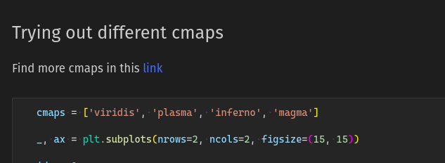

# Contributing


[](https://makeapullrequest.com)

[](https://forthebadge.com) [](https://www.python.org/)

Contributions are welcome, and they are greatly appreciated! Every bit helps, and credit will always be given. You can contribute in many ways.

# Types of Contributions

## Contributing code

### Contributing new category of plots

If you want to add a new category of plots, which is missing in the `visualizations` directory, all you'd have to do is create a new folder with the name of the plot, e.g., **visualiazations/Piechart**

Afterwards add your notebook inside the directory with the following naming conventions,

`{Type_Of_Chart}s.ipynb`

For example, for **visualizations/Piechart** it would simply be `Piecharts.ipynb`. The first cell of your notebook should be the following code block

```python
import sys; sys.path.append('../../utils')
import utils

# Your dependencies goes here
```

### Contributing plots to new existing notebooks

If you're to contribute in an already existing notebook, please following the mentioned format.

* Add what's essentially the `h2` tag equivalent in markdown, i.e., `##` followed by a simple title to your plot
* The following code block will contain a your code that will output in the notebook.
* The last step is to add the code that will save the your image in the `gallery` directory



_Fig: Header tag (`##`) before your codeblock_

## Report errors / deprecated info in project

# Write Documentation

**Working on your first Pull request?** You can learn how from this _free_ series [How to Contribute to an Open Source Project on GitHub](https://egghead.io/courses/how-to-contribute-to-an-open-source-project-on-github)
