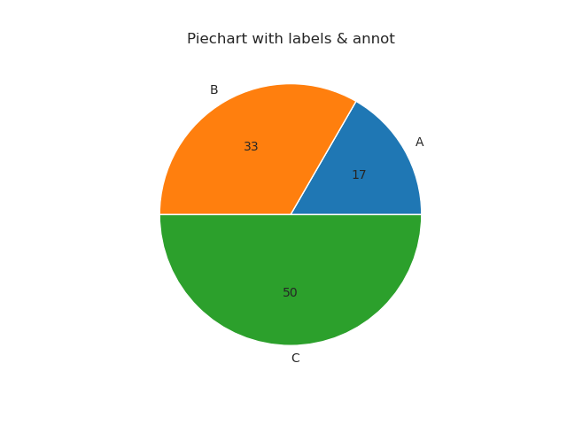
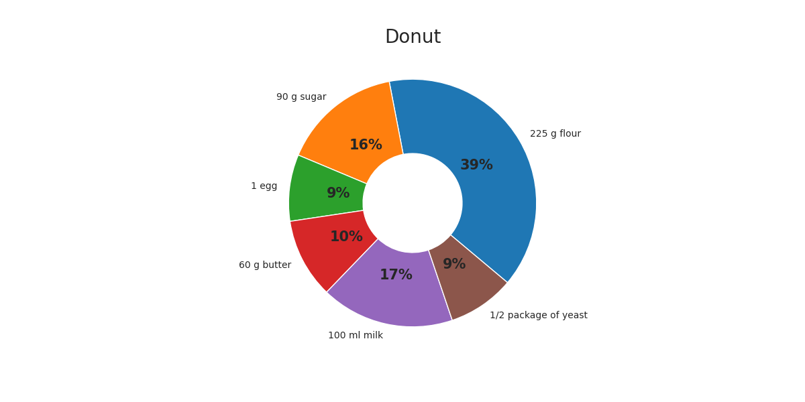
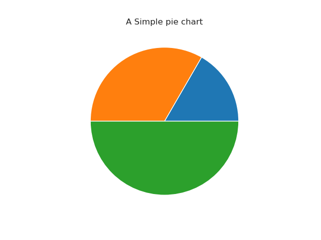
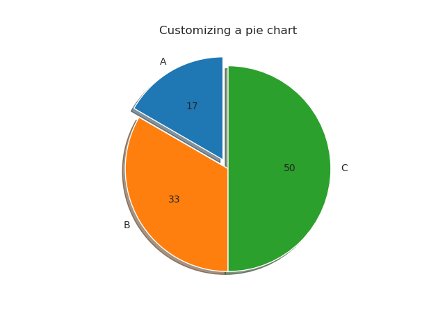
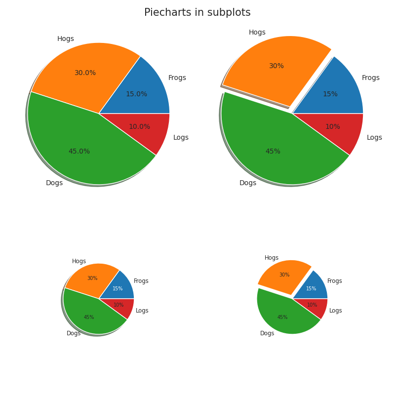

# Piechart
## Matplotlib
Plots created using the package `Matplotlib`

 

 

 

 

## Seaborn
Plots created using the package `Seaborn`

## Plotnine (ggplot)
Plots created using the package `Plotnine (ggplot)`

## Plotly
Plots created using the package `Plotly`
